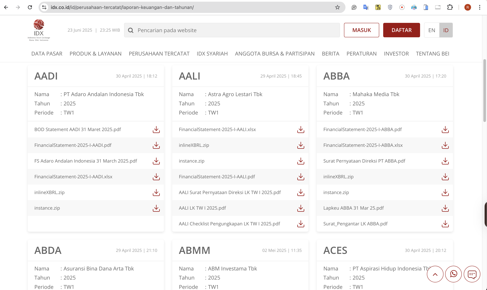
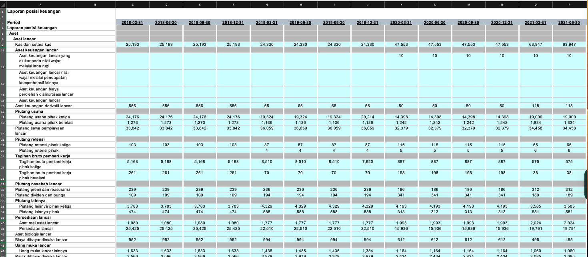
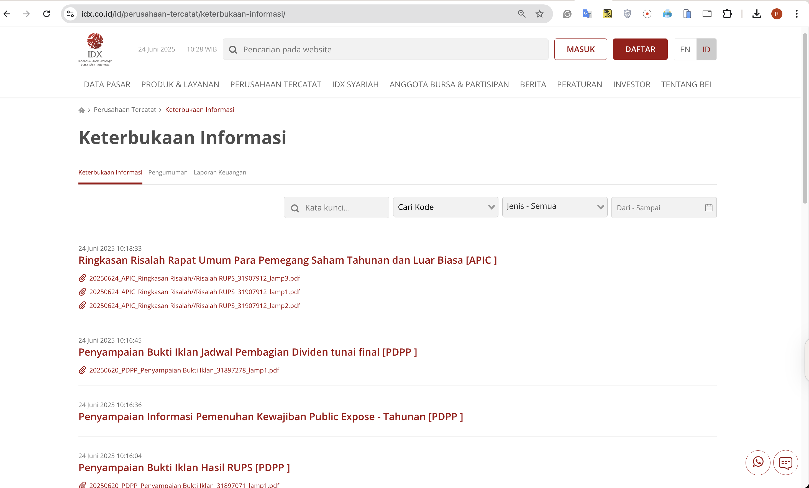
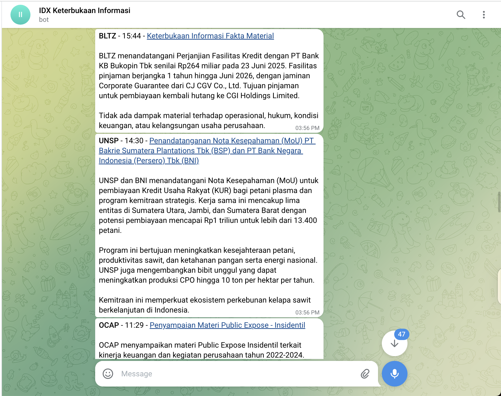
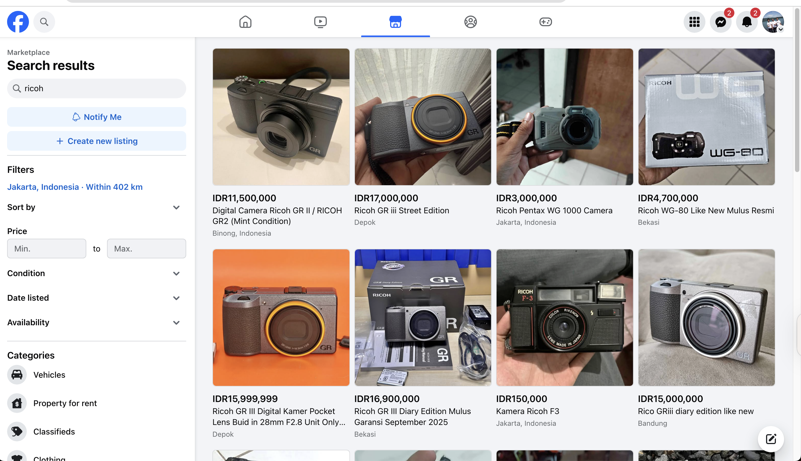
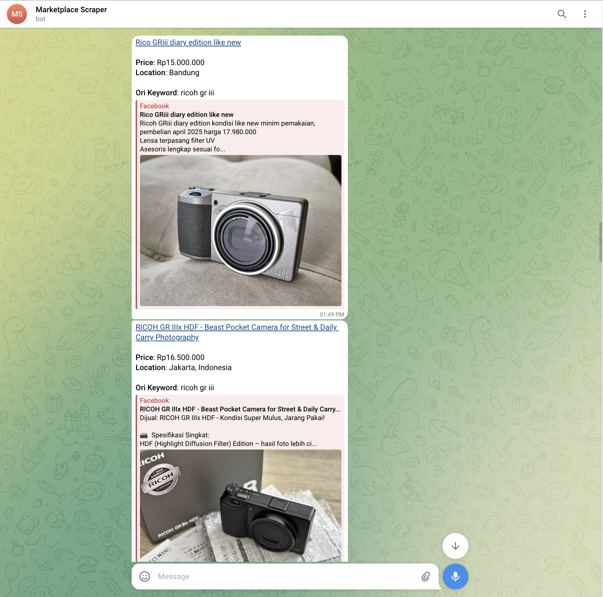
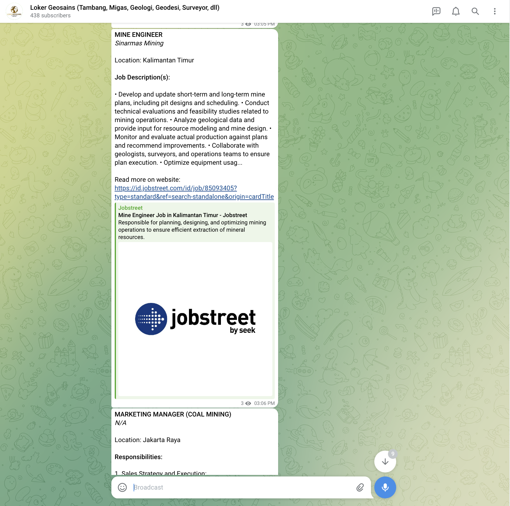
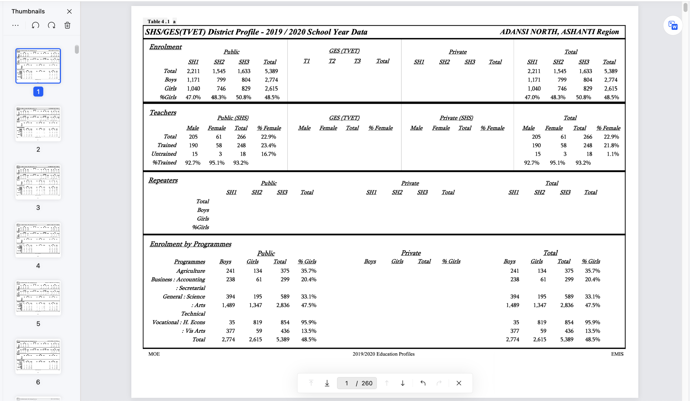
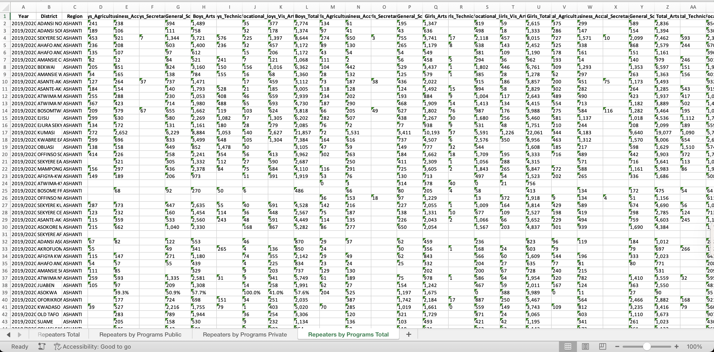
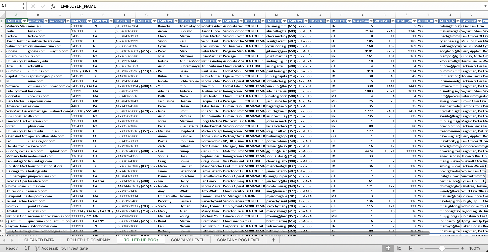

# Portfolio
---
## Data Extraction & Processing

### IDX Financial Report Extractor

     

 

This project provides a Python tool to automate the scraping of raw financial data from the Indonesia Stock Exchange (IDX). It eliminates tedious manual data collection for investors, analysts, and researchers by delivering the information in a ready-to-use Excel format for immediate analysis. See result examples <a href="https://github.com/Rachdyan/idx_financial_report/tree/main/result">here</a>.

     

 

&#8595;

   

---
### IDX Company Disclosure Summarizer

    
    
    
    

     

 

This project automates intelligence gathering from the Indonesia Stock Exchange (IDX). It continuously monitors for new company disclosures every few hours, uses AI to generate concise summaries of the documents, and delivers these key insights directly to users via a Telegram Bot. This provides a timely source for trading ideas and allows for rapid analysis of market-moving news.

 

 

&#8595;

   

---
### Facebook Marketplace Deals Finder

     

 

Tired of manually refreshing Facebook Marketplace and missing out on the best bargains? This project deploys a sophisticated automated tool to hunt for deals on your behalf. It leverages advanced techniques to programmatically handle 2FA logins and bypass CAPTCHA challenges, ensuring consistent, uninterrupted access to the platform. Once running, the tool monitors the marketplace daily for products matching your predefined criteria and price range, instantly forwarding new deals to you via a Telegram bot.

 

 

&#8595;

   

---
### Geoscience Job Hunter Bot

     

This tool automates the job hunt for geoscientists by scraping top job boards like Indeed, LinkedIn, and Jobstreet for relevant roles. It then consolidates all openings in geology, geophysics, and engineering, and broadcasts them to the dedicated Loker Geosains Telegram channel.

 

 

---

### Extract Africa Senior High Schools Report From Unstructured PDF

     

This R project automates the extraction of data on African Senior High Schools from complex PDF files published by <a href="https://africaeducationwatch.org/emis-data-shs-reports">Africa Education Watch</a>. Using the pdftools and tabulizer libraries, it parses the unstructured reports and outputs the information into clean Excel spreadsheets, ready for analysis.

 

 

&#8595;

   

---

### USA Labor Condition Application (LCA) Disclosures Data Cleaning

     

This project transforms raw LCA disclosure data from the <a href="https://www.dol.gov/agencies/eta/foreign-labor/performance">U.S. Department of Labor</a> into a high-quality, actionable dataset. It standardizes employer names by removing legal suffixes, uses fuzzy matching to fix typos in company and contact information, and filters out contacts with generic or personal emails to isolate key decision-makers. The final output is a clean, de-duplicated list of companies and their contacts, complete with aggregated summaries of their total visa filings.

 

 

---

## Data Dashboard & Application

### Credit Risk Prediction Web App

After my team preprocessed a dataset of 10K credit applications and built machine learning models to predict credit default risk, I built an interactive user interface with Streamlit and hosted the web app on Heroku server.

 

 

---
### Kaggle Competition: Predict Ames House Price using Lasso, Ridge, XGBoost and LightGBM

I performed comprehensive EDA to understand important variables, handled missing values, outliers, performed feature engineering, and ensembled machine learning models to predict house prices. My best model had Mean Absolute Error (MAE) of 12293.919, ranking <b>95/15502</b>, approximately <b>top 0.6%</b> in the Kaggle leaderboard.

 

 

---
### Predict Breast Cancer with RF, PCA and SVM using Python

In this project I am going to perform comprehensive EDA on the breast cancer dataset, then transform the data using Principal Components Analysis (PCA) and use Support Vector Machine (SVM) model to predict whether a patient has breast cancer.

 

 

---
### Business Analytics Conference 2018: How is NYC's Government Using Money?

In three-month research and a two-day hackathon, I led a team of four students to discover insights from 6 million records of NYC and Boston government spending data sets and won runner-up prize for the best research poster out of 18 participating colleges.

 

 

---
## Filmed by me

Besides Data Science, I also have a great passion for photography and videography. Below is a list of films I documented to retain beautiful memories of places I traveled to and amazing people I met on the way.

 

- [Ada Von Weiss - You Regret (Winter at Niagara)](https://www.youtube.com/watch?v=-5esqvmPnHI)
- [The Weight We Carry is Love - TORONTO](https://www.youtube.com/watch?v=vfZwdEWgUPE)
- [In America - Boston 2017](https://www.youtube.com/watch?v=YdXufiebgyc)
- [In America - We Call This Place Our Home (Massachusetts)](https://www.youtube.com/watch?v=jzfcM_iO0FU)

---

© 2020 Khanh Tran. Powered by Jekyll and the Minimal Theme.

