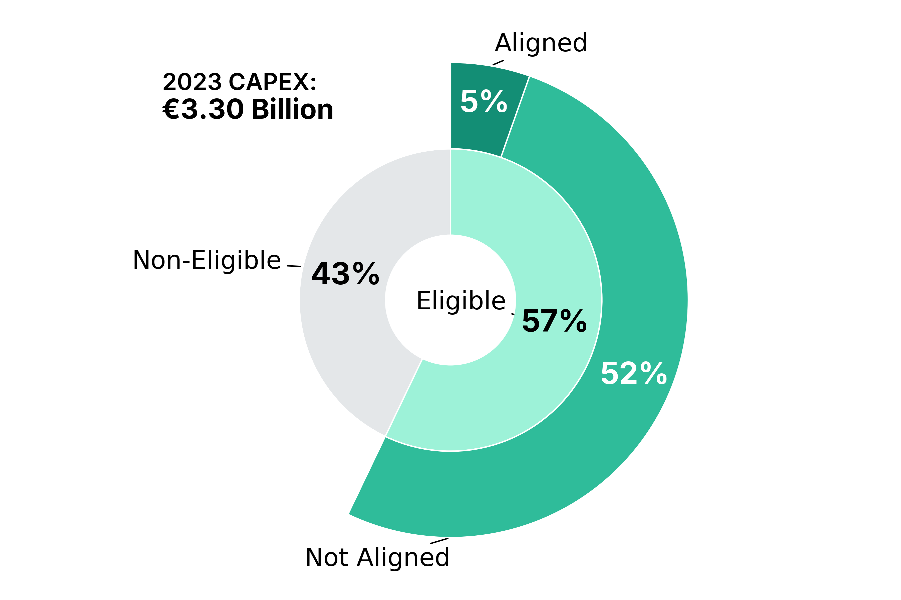

# Portfolio
---
## Data Extraction & Processing

### IDX Financial Report Extractor

     

 

This project provides a Python tool to automate the scraping of raw financial data from the Indonesia Stock Exchange (IDX). It eliminates tedious manual data collection for investors, analysts, and researchers by delivering the information in a ready-to-use Excel format for immediate analysis. See result examples <a href="https://github.com/Rachdyan/idx_financial_report/tree/main/result" target="_blank">here</a>.

     

 

&#8595;

   

     

---
### IDX Company Disclosure Summarizer

    
    
    
    

     

 

This project automates intelligence gathering from the Indonesia Stock Exchange (IDX). It continuously monitors for new company disclosures every few hours, uses AI to generate concise summaries of the documents, and delivers these key insights directly to users via a Telegram Bot. This provides a timely source for trading ideas and allows for rapid analysis of market-moving news.

     

 

&#8595;

   

     

---
### Facebook Marketplace Deals Finder

     

 

Tired of manually refreshing Facebook Marketplace and missing out on the best bargains? This project deploys a sophisticated automated tool to hunt for deals on your behalf. It leverages advanced techniques to programmatically handle 2FA logins and bypass CAPTCHA challenges, ensuring consistent, uninterrupted access to the platform. Once running, the tool monitors the marketplace daily for products matching your predefined criteria and price range, instantly forwarding new deals to you via a Telegram bot.

     

 

&#8595;

   

---
### Geoscience Job Hunter Bot

     

This tool automates the job hunt for geoscientists by scraping top job boards like Indeed, LinkedIn, and Jobstreet for relevant roles. It then consolidates all openings in geology, geophysics, and engineering, and broadcasts them to the dedicated Loker Geosains Telegram channel.

     

     

---

### Extract Africa Senior High Schools Report From Unstructured PDF

     

This R project automates the extraction of data on African Senior High Schools from complex PDF files published by <a href="https://africaeducationwatch.org/emis-data-shs-reports">Africa Education Watch</a>. Using the pdftools and tabulizer libraries, it parses the unstructured reports and outputs the information into clean Excel spreadsheets, ready for analysis.

     

 

&#8595;

   

     

---

### USA Labor Condition Application (LCA) Disclosures Data Cleaning

     

This project transforms raw LCA disclosure data from the <a href="https://www.dol.gov/agencies/eta/foreign-labor/performance">U.S. Department of Labor</a> into a high-quality, actionable dataset. It standardizes employer names by removing legal suffixes, uses fuzzy matching to fix typos in company and contact information, and filters out contacts with generic or personal emails to isolate key decision-makers. The final output is a clean, de-duplicated list of companies and their contacts, complete with aggregated summaries of their total visa filings.

     

 

     

---

### 99acres Scraper

     

An R project to scrape property listings from 99acres.com that allows users to build custom search queries based on property type, location, and price, supports proxies, handles pagination, and extracts detailed information for each listing into a clean Excel file.

     

 

&#8595;

   

     

---

## Data Dashboard & Application

### USA Mining Bond Exposure Map

     

An interactive R Shiny web application that visualizes mining reclamation bond exposure across the USA, allowing users to filter and explore data by state and commodity type on an interactive map.

 

 

---
### Insurance Companies Comparison Dashboard

     

An interactive R Shiny dashboard that provides a comprehensive analysis of the insurance market by allowing users to compare and visualize key financial and operational metrics—such as premiums, losses, and policy counts—across Insurance Groups, Firms, and MGAs, and then export the custom analysis to PDF and Excel.

 

 

---
### Geology Rock Sample Dashboard

     

This interactive R Shiny dashboard provides a comprehensive multi-tab suite for exploring geological rock sample data. It features seven distinct analyses, such as particle screen sizing, elemental grade, and X-ray results, each with dynamic filtering. All visualizations are highly interactive, allowing users to hover for details and zoom on areas of interest within a clean, modern interface.

 

 

---
### ITB Digital Library Downloader Apps

     

An R Shiny app designed to solve the challenges of downloading publications from the <a href="https://digilib.itb.ac.id/" target="_blank">ITB Digital Library</a>, where documents are split into multiple chapters and the direct download link for each part is hidden. After a user pastes a single URL, the app automatically scrapes all hidden chapter links, merges them with a cloud API, and provides a single download link for the complete document.

 

 

---
## Data Visualization

### ESG Data Visualization using Python

     

This project transforms complex ESG data—including GHG Emissions, EU Taxonomy, and emission reduction targets—into insightful visualizations. The core objective is to create visually stunning dashboards that are both engaging and immediately understandable, ensuring that intricate sustainability information is presented with absolute clarity. The entire pipeline, from processing raw data to generating the final plots, is executed exclusively using Python.

 
<table style="width:100%; border-collapse: collapse; table-layout: fixed;">
  <tr>
    <td style="width: 50%; padding: 10px; text-align:center;">
      
    </td>
    <td style="width: 50%; padding: 10px; text-align:center;">
      
    </td>
  </tr>
  <tr>
    <td style="width: 50%; padding: 10px; text-align:center;">
      
    </td>
    <td style="width: 50%; padding: 10px; text-align:center;">
      
    </td>
  </tr>
  <tr>
    <td style="width: 50%; padding: 10px; text-align:center;">
      
    </td>
    <td style="width: 50%; padding: 10px; text-align:center;">
      
    </td>
  </tr>
  <tr>
    <td style="width: 50%; padding: 10px; text-align:center;">
      
    </td>
    <td style="width: 50%; padding: 10px; text-align:center;">
      
    </td>
  </tr>
  <tr>
    <td style="width: 50%; padding: 10px; text-align:center;">
      
    </td>
    <td style="width: 50%; padding: 10px; text-align:center;">
      
    </td>
  </tr>
  <tr>
    <td style="width: 50%; padding: 10px; text-align:center;">
      
    </td>
    <td style="width: 50%; padding: 10px; text-align:center;">
      
    </td>
  </tr>
  <tr>
    <td style="width: 50%; padding: 10px; text-align:center;">
      
    </td>
    <td style="width: 50%; padding: 10px; text-align:center;">
      
    </td>
  </tr>
  <tr>
    <td style="width: 50%; padding: 10px; text-align:center;">
      
    </td>
    <td style="width: 50%; padding: 10px; text-align:center;">
      
    </td>
  </tr>
</table>
---

© 2025 Rachdyan Naufal. Powered by Jekyll and the Minimal Theme.

